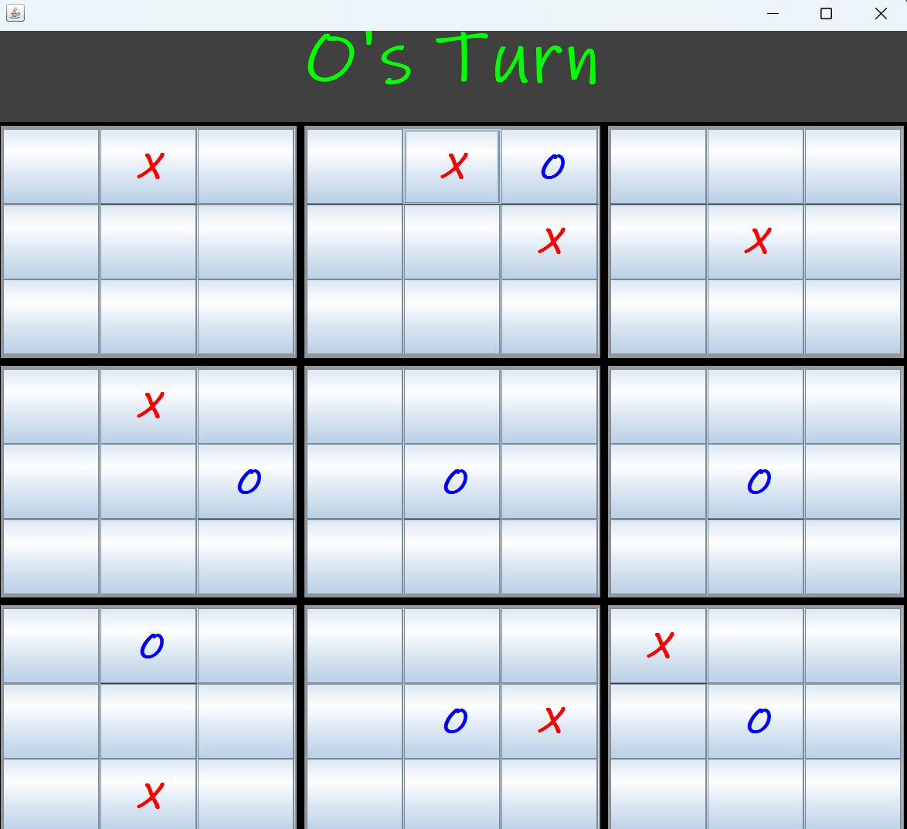
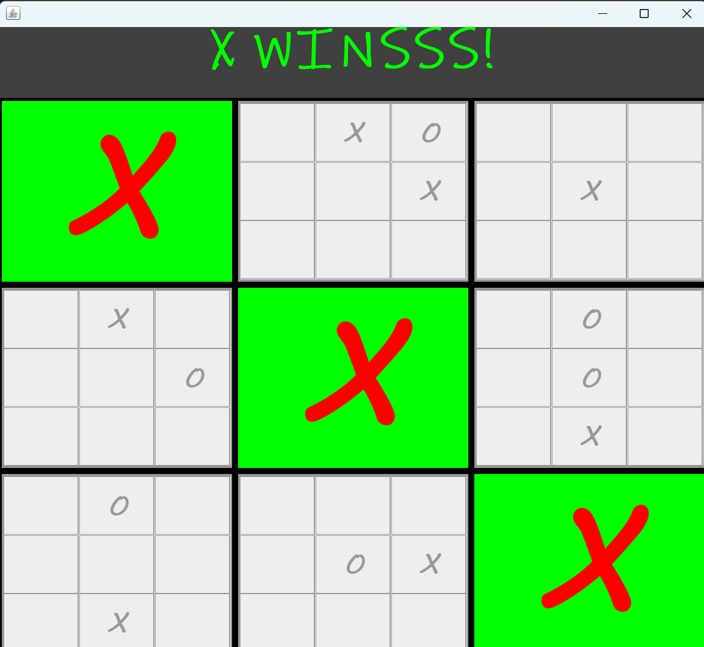

# Super Tic-Tac-Toe

## Description
Super Tic-Tac-Toe is a Java application that implements a modified version of the classic Tic-Tac-Toe game. In this version, players have to play with 9 Tic-Tac-Toe boards, individually contributing to a bigger 3x3, To win Player has to win atleast 3 boards, in such a way that the boards are in a winning sequence in the bigger Board.

## Features
- Classic Tic-Tac-Toe gameplay.
- Bigger Version, making it more interesting and fun to play.
- Graphical user interface using Java Swing.
- Random selection of the starting player.

## Installation
1. Clone the repository to your local machine.
2. Open the project in your Java IDE (e.g., IntelliJ IDEA, Eclipse, VS Code).
3. Build and run the `Tmain.java` file.

## Usage
- When it's your turn, click on an empty cell to place your X or O.
- The game will automatically switch turns between X and O.
- Once you win a board, That board will be freezed.

## Screenshots

## Contributing
Contributions are welcome! If you find any bugs or have suggestions for improvements, please open an issue or create a pull request.

